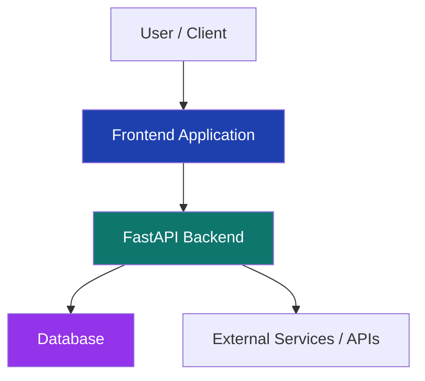

# 🚀 ReliefHands

### ⚡ Smart Coordination Platform powered by FastAPI


---

## 🌍 Overview

**ReliefHands** is a scalable platform designed to streamline coordination and communication in critical scenarios. Built using **FastAPI**, the system ensures high performance, asynchronous processing, and efficient handling of real-time interactions.

The project focuses on delivering a **clean architecture**, **fast backend responses**, and a **user-friendly frontend**, making it suitable for real-world applications.

---

## 🎯 Key Features

✨ High-performance backend powered by FastAPI
⚡ Asynchronous request handling
📡 Scalable API architecture
🧩 Modular and clean codebase
🔐 Ready for authentication & security integration
🚀 Easy deployment and extensibility

---

## 🏗️ Architecture Diagram



---

## 📁 Project Structure

```
RELIEFHANDS/
├── frontend/        # UI Layer (React / Flutter)
├── backend/         # FastAPI server & APIs
├── .vscode/         # Editor configs
├── .gitignore
└── README.md
```

---

## ⚙️ Tech Stack

* **Backend:** FastAPI (Python)
* **Frontend:**  React 
* **Database:** MongoDB 
* **Tools:** Git, VS Code

---

## 🚀 Getting Started

### 1️⃣ Clone Repository

```bash
git clone https://github.com/sumit-chillal/reliefhands.git
cd reliefhands
```

### 2️⃣ Backend Setup (FastAPI)

```bash
cd backend
pip install -r requirements.txt
uvicorn main:app --reload
```

### 3️⃣ Frontend Setup

```bash
cd frontend
npm install
npm run dev
```

---

## 📊 Performance Advantage

FastAPI provides:

* ⚡ Up to **2-3x faster** performance than traditional frameworks
* 🔄 Built-in async support
* 📚 Automatic API documentation (Swagger UI)

---

## 🔮 Future Enhancements

* 🔗 Real-time communication (WebSockets)
* 📱 Cross-platform mobile integration
* 🧠 AI-powered decision support
* 🔐 Advanced authentication & role-based access

---

## 🤝 Contributing

Contributions are welcome!
Feel free to fork, improve, and submit a pull request.

---

## 📄 License

This project is licensed under the MIT License.

---

## 👨‍💻 Author

**Sumit**

---

## ⭐ Support

If you like this project, give it a ⭐ on GitHub!
